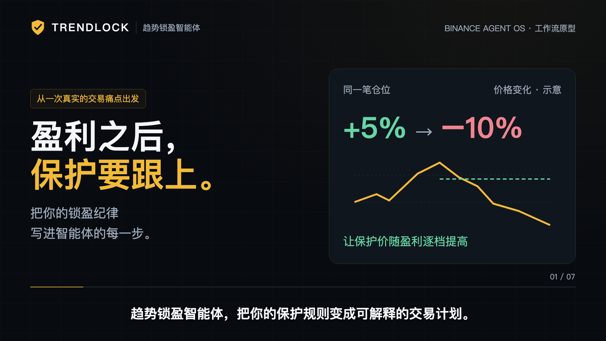

# TrendLock Agent · 趋势锁盈智能体

TrendLock 是为 Binance Agent OS Mini Hackathon 制作的合约决策与 PAPER 自动化原型。它扫描流动性靠前的 USDⓈ-M 山寨币永续合约，把市场分为 `LONG`、`SHORT`、`RANGE` 或 `NO_TRADE`，再用确定性规则计算仓位预算、自动运行趋势保护阶梯或独立做多网格模拟。

[公开体验](https://trendlock-agent.jacksonning.chatgpt.site) · [中文演示视频与下载](https://github.com/wyycj1124-jpg/trendlock-agent/releases/tag/v0.1.0) · [提交文案](SUBMISSION.md)

[](https://github.com/wyycj1124-jpg/trendlock-agent/releases/download/v0.1.0/trendlock-intro-zh.mp4)

它解决的不是“AI 猜涨跌”，而是持仓一度盈利却没及时移动止损、最后把利润全部吐回的问题。所有百分比相对真实加权开仓均价，而不是杠杆后的仓位收益率：

- 默认单笔账户风险预算 10%（激进设置，不是保证亏损上限）；
- 初始保护 −7%；
- 有利变化达到 +5% 后保护 +2%；
- 达到 +8% 后保护 +5%；
- 达到 +11% 后保护 +8%；
- 达到 +15% 后切换宽幅追踪：`回撤带 = clamp(1.5 × 1h ATR(14), 5%, 8%)`，至少锁定 +10%；
- 多空镜像，保护价只能收紧、不能放松；价格回撤越过旧保护线后，模拟仓位关闭且不会自动恢复。

## 今晚版本能做什么

- 可复现的合成演示，覆盖多、空、震荡和拒绝四种状态。
- 公开 Binance Futures REST 行情扫描；受 Binance 地区规则和网络可用性影响。
- 导入由 Binance MCP 或官方 `binance` skill 采集的原始行情 JSON，并在本地重新计算，不信任外部评分。
- 只使用已收盘且连续、未过期的 K 线；缺资金费率、异常盘口、过期数据或硬规则失败都会拒绝。
- 趋势仓位按账户风险预算计算；0.2% 名义仓位成本预留只是示例，不是最大亏损保证。
- `RANGE` 只生成独立做多网格草稿；它不会把亏损趋势仓位变成网格。
- 网页内阶梯止损沙盒、计划 JSON 导出，以及 6 个页面级 WebMCP 工具。
- 双槽位审批编排：只提名评分 ≥90 的前两名，已有持仓或开仓委托占用槽位，释放后必须重新扫描。
- 双槽位模式下，用户设定的 10% 按组合总风险解释，每个槽位最多分配 5%；不因只出现一个候选而放大到 10%。
- PAPER 自动化：合成行情自动播放，或每 5 秒读取 Binance 公开标记价格，自动推进趋势止损和网格成交状态。
- MCP 监督执行：录入 MCP 读回的真实成交均价、数量和现有服务器止损后，每 5 秒监控该持仓交易对；触发阶梯时生成待确认改单指令，用户执行并读回核验后才更新本地状态。
- 自动化状态保存在当前浏览器；刷新或离开页面后恢复为 `HALTED`，不会悄悄续跑。
- 行情超过 30 秒、连续三次取价失败、触及保护线或网格硬退出都会停止状态机并保留审计事件。

## 明确边界

网页版本没有直接连接账户，也没有测试网或实盘下单。PAPER 自动化只运行虚拟成交；MCP 监督执行只在浏览器本地保存用户录入的持仓状态并生成确认指令。浏览器页面关闭后不会后台常驻。导入文件里的 `transport: MCP` 是提供方声明，界面始终显示“未验签”。它不提供收益率、胜率、回测或盈利保证。

官方 Binance MCP 支持市场数据、账户和交易，但交易、撤单和转账需要用户逐次确认，且运行在专用 Agentic 子账户。TrendLock 不会绕过这层确认；MCP 实盘执行仍属于人工监督流程。

当前连接暴露的 U 本位新订单工具虽然列出 `STOP_MARKET`，却没有暴露必需的 `stopPrice` / `closePosition` 参数，也没有原生合约网格工具。因此当前版本可以自动排名、生成只读预检和等待确认，但会在真实开仓前返回 `EXECUTION_BLOCKED`：不允许出现“开仓成功、服务器止损未创建”的窗口。

## 本地自动化核心

`daemon/` 新增了不依赖 MCP 确认或大模型轮询的本地常驻核心。它默认 `DRY_RUN`，支持趋势多空成交读回、服务器硬止损、先建后撤的阶梯/ATR 改单、双槽位、重启恢复、熔断、审计与本地日报。实盘采用 Binance 官方 USDⓈ-M API，必须使用本机受限 API Key 和显式风险解锁；未知人工仓位不会被接管。网格和持仓评分下降提前退出仍失败关闭。

完整操作与风险边界见 [本地自动化核心说明](docs/AUTONOMOUS_DAEMON.md)。先运行：

```bash
npm run daemon:smoke
npm run daemon:doctor
```

## 双槽位审批流程

1. 用 Binance MCP 只读获取 U 本位余额、非零持仓、全部未成交委托和持仓模式。
2. 将非零持仓或开仓委托所在币种计为已占用槽位；最多两个不同币种。
3. 对空槽位执行新一轮公开行情扫描，排除已占用币种，只保留评分 ≥90 且未过期的前 N 名。
4. 按真实权益、价格精度和数量步长生成一张具体确认卡；此阶段不执行写操作。
5. 你只确认这张卡上的具体交易。评分、价格、数量或止损变化后旧确认作废，必须重新预检。
6. 只有在 MCP 可先保证服务器保护单可创建和读回时才能开仓；否则失败关闭。

完整状态和安全契约见 [审批编排说明](docs/APPROVAL_ORCHESTRATION.md)。

## 使用自动化试运行

1. 选择“合成演示”快速观察状态机，或选择“公开行情”后运行一次扫描。
2. 从机会队列选择一个通过全部硬条件的 `LONG`、`SHORT` 或 `RANGE` 候选。
3. 设置假设权益、单笔账户风险、初始硬止损、杠杆和网格间距并应用参数。当前默认 10% 账户风险与 −7% 硬止损属于激进示例。
4. 点击“启动 PAPER 自动化”。趋势模式会从模拟成交均价计算保护线；网格模式会自动记录虚拟买入、反弹卖出和硬退出。
5. 观察当前标记价格、保护价/已买入格数、浮动损益和最近事件。点击“停止并冻结”可随时终止。

公开行情自动化必须保持网页打开。要恢复一个刷新前仍在运行的实例，必须先核对持仓和挂单，再重新扫描并启动新的实例。

## 监督真实持仓

1. 在 Codex 中通过 Binance MCP 读取真实持仓、持仓模式和当前保护单，不要依赖页面计划值。
2. 在“MCP 监督执行”录入交易对、方向、`positionSide`、真实加权开仓均价、真实数量和已经挂在币安服务器上的止损。
3. 点击“开始监督监控”。页面只读取该交易对的公开标记价格，不读取账户。
4. 达到阶梯后，页面显示“待你确认改单”。复制指令到已经连接 Binance MCP 的 Codex 对话；先核验参数，再由你确认写操作。
5. 只有在 MCP 创建新保护、读回验证且正确处理旧保护后，才能点击“我已执行并读回核验”。如果确认前已经回撤越过请求的新止损，任务会废弃动作并要求对账。

页面每 5 秒读取一次公开标记价格并运行本地 TypeScript 状态机，不调用大模型，因此本身不消耗 Codex 模型用量。定时 Agent 巡检会消耗模型用量；1 小时策略只应在新收盘 K 线出现时做全市场扫描，持仓的高频盯价交给本地状态机，模型只处理异常、候选确认和真实账户写操作。

这个网页监控器适合当前人工监督试行，不是 24/7 守护进程。现有保护单应始终由币安服务器托管；关页、休眠或断网时，旧保护仍在，但不会继续提高阶梯。完整架构和下一阶段见 [监督执行说明](docs/SUPERVISED_EXECUTION.md)。

## 本地运行

需要 Node.js 22.18 以上，推荐 Node.js 24。

```bash
npm ci
npm run dev
```

验证：

```bash
npm run lint
npm run typecheck
npm test
npm run build
```

## Agent 数据工作流

项目内的 `agent-skill/trendlock-agent/` 是可分发的只读 Skill；`agent-skill/trendlock-executor/` 是独立的审批执行 Skill，不会把市场扫描权限自动升级为交易权限。已安装 Binance 官方 CLI 时，可选本地适配器只调用公开 GET 端点：

```bash
node scripts/collect-binance.ts SOLUSDT,LINKUSDT,DOGEUSDT 1h > evidence.json
node scripts/evaluate-evidence.ts evidence.json > analysis.json
npm run approval:scan -- 50 LINKUSDT
```

也可以让已连接的 Binance MCP 按 `agent-skill/trendlock-agent/references/result-contract.md` 生成 `trendlock.market/v1`，再通过网页“导入 Agent 行情 JSON”。不要把 MCP 地址、授权链接、账户数据或密钥放进 JSON。

## 设计原则

AI/Agent 负责取数和提名；本仓库的确定性引擎负责规则、否决、风险预算与状态机。零候选是有效结果。低价币不等于低风险，价格跌得多也不等于处在低位。

本项目从 [Setup Radar](https://github.com/jian28277-hash/setup-radar) 获得“只读、证据优先、保留工具轨迹”的产品启发。参考仓库未提供许可证，因此本项目没有复制其代码或素材。

## 演示视频

`video/` 包含完整 Remotion 工程、中文配音、逐句字幕、实际产品截图和合成规则动画。成片为 1920×1080、30 fps、约 102 秒。动画里的风险与阶梯状态直接取自本仓库规则引擎；不是实盘录制或收益证明。

```bash
cd video
npm ci
npx remotion studio --no-open
npx remotion render TrendLockIntro out/trendlock-intro-zh.mp4
```

配音使用本地 macOS Tingting 合成语音。随仓库提供的 WAV 可直接在其他系统渲染；只有重新生成配音时才需要 macOS 的 `say` 和 `afinfo`。浏览器的 WebMCP 工具可读取、模拟、生成计划并启动/停止 PAPER 自动化；它们与 Binance MCP 账户连接是不同的能力。

## License

MIT，见 `LICENSE`。本项目不构成投资建议。
